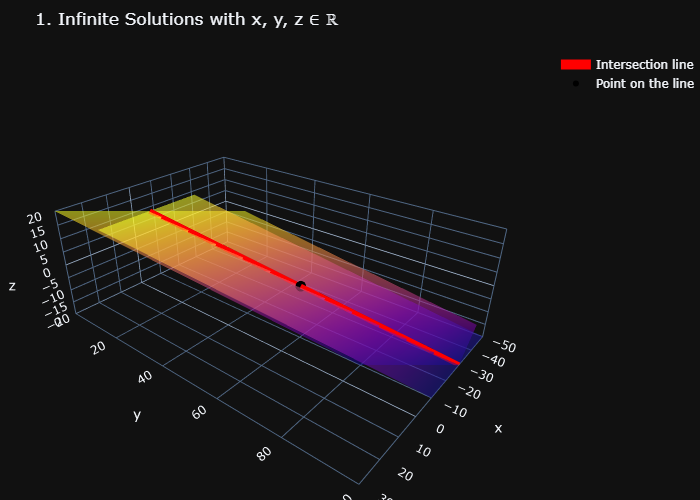
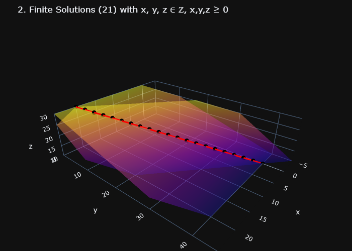

# Linear Systems – Truck Transportation Problem

## 🇺🇸 English

This repository contains the solution and computational illustration for **Activity 1** of the course **Vector Space Structures**.

The activity is part of the **Professional Master's Program in Applied and Computational Mathematics (PM-001)** at **UNICAMP – University of Campinas**, 2026.

### Problem Description

A transportation company has three types of trucks capable of transporting boxes of three types (A, B, C). When fully loaded, each truck type carries the following quantities:

| Box Type | Truck I | Truck II | Truck III |
|----------|--------|----------|-----------|
| A | 100 | 50 | 0 |
| B | 30 | 30 | 30 |
| C | 230 | 130 | 30 |

The problem consists of determining how many trucks of each type are necessary to transport a specific number of boxes.

The system can be modeled as a **linear system**.

### Objectives of the Assignment

The exercise requires:

1. Modifying the original matrix problem so that:
   - The number of **type C boxes transported by each truck** is always a **multiple of the largest digit of the student's RA**.

2. Ensuring that the resulting problem has:
   - A **finite set of solutions**
   - **More than one valid solution**

3. Illustrating computationally:
   - The **general solution of the associated linear system** (which has infinitely many solutions in ℝ)
   - The **finite set of integer solutions** corresponding to the transportation problem.

### Computational Illustration

The notebook:
`task01_linearsystem.ipynb`

contains:

- Construction of the linear system
- Parametric solution of the system
- Visualization of the solution space
- Enumeration of feasible integer solutions under constraints

The ilustrations:

### Mathematical Topics

This activity involves concepts from:

- Linear systems
- Matrix representation
- Parametric solutions
- Integer constraints
- Geometric interpretation of solution sets

---

## 🇧🇷 Português

Este repositório contém a solução e a ilustração computacional da **Atividade 1** da disciplina **Estruturas de Espaços Vetoriais**.

A atividade faz parte do **Mestrado Profissional em Matemática Aplicada e Computacional (PM-001)** da **UNICAMP – Universidade Estadual de Campinas**, ano **2026**.

### Descrição do Problema

Uma companhia de transporte possui três tipos de caminhões capazes de transportar caixas de três tipos (A, B, C). Quando completamente carregados, cada tipo transporta:

| Tipo de Caixa | Caminhão I | Caminhão II | Caminhão III |
|---------------|-----------|-------------|--------------|
| A | 100 | 50 | 0 |
| B | 30 | 30 | 30 |
| C | 230 | 130 | 30 |

O problema consiste em determinar quantos caminhões de cada tipo são necessários para transportar quantidades específicas de caixas.

O problema pode ser modelado como um **sistema linear**.

### Objetivos da Atividade

O exercício pede:

1. Modificar o problema original de forma que:
   - O número de **caixas do tipo C transportadas por cada caminhão** seja sempre **múltiplo do maior dígito do RA do aluno**.

2. Garantir que o problema resultante possua:
   - Um **conjunto finito de soluções**
   - **Mais de uma solução possível**

3. Ilustrar computacionalmente:
   - A **solução geral do sistema linear associado** (que possui infinitas soluções em ℝ)
   - As **soluções inteiras possíveis** que satisfazem as restrições do problema de transporte.

### Ilustração Computacional

O notebook: `task01_linearsystem.ipynb`

contém:

- Construção do sistema linear
- Determinação da solução paramétrica
- Visualização do espaço de soluções
- Enumeração das soluções inteiras viáveis

As ilustrações:

### Tópicos Matemáticos

Esta atividade envolve conceitos de:

- Sistemas lineares
- Representação matricial
- Solução paramétrica
- Restrições inteiras
- Interpretação geométrica do conjunto solução