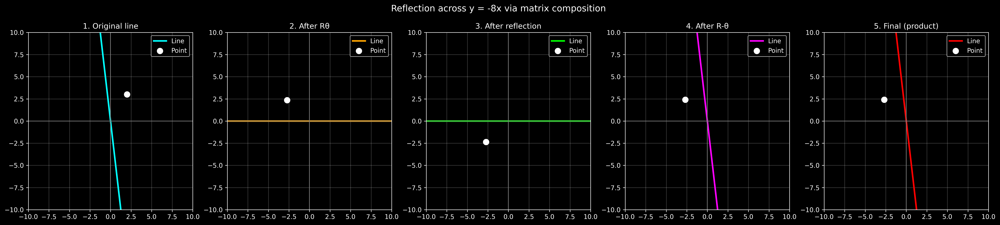

# Reflection across the line y = -8x / Reflexão na reta y = -8x

---

## 🇧🇷 Português

### Descrição

Este projeto ilustra uma transformação linear no plano `R²` que corresponde a uma reflexão na reta `y = -8x`.

A transformação é construída como a composição de três etapas:

1. Rotação do plano para alinhar a reta com o eixo `x`;
2. Reflexão em relação ao eixo `x`;
3. Rotação inversa para retornar ao sistema original.

Matematicamente, a transformação é dada por:

`T = R(-θ) · F · R(θ)`

### Metodologia

- A reta `y = -8x` é representada pelo vetor diretor `v = (1, -8)`;
- O ângulo de rotação é obtido a partir desse vetor;
- As matrizes são construídas diretamente no código;
- A transformação é aplicada:
  - à própria reta, que permanece inalterada;
  - a um ponto fora da reta, para visualizar a reflexão.

### Visualização

O código gera 5 gráficos:

1. Reta original;
2. Após a rotação `R(θ)`;
3. Após a reflexão `F`;
4. Após a rotação inversa `R(-θ)`;
5. Resultado final usando o produto total.

### Resultado

- A reta de reflexão permanece inalterada;
- Pontos fora da reta são refletidos simetricamente;
- O resultado final coincide com a composição das três matrizes.

---

## 🇺🇸 English

### Description

This project illustrates a linear transformation in `R²` corresponding to a reflection across the line `y = -8x`.

The transformation is built as a composition of three steps:

1. Rotate the plane to align the line with the `x`-axis;
2. Reflect across the `x`-axis;
3. Rotate back to the original position.

Mathematically, the transformation is:

`T = R(-θ) · F · R(θ)`

### Methodology

- The line `y = -8x` is represented by the direction vector `v = (1, -8)`;
- The rotation angle is obtained from this vector;
- The matrices are built directly in the code;
- The transformation is applied to:
  - the line itself, which remains unchanged;
  - a point outside the line, to make the reflection visible.

### Visualization

The code produces 5 plots:

1. Original line;
2. After the rotation `R(θ)`;
3. After the reflection `F`;
4. After the inverse rotation `R(-θ)`;
5. Final result using the full product.

### Result

- The reflection line remains unchanged;
- Points outside the line are reflected symmetrically;
- The final result matches the composition of the three matrices.