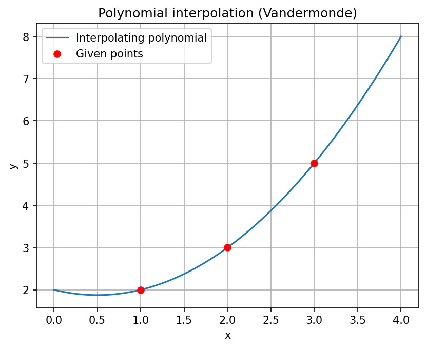

# Polynomial Interpolation (Vandermonde)

------------------------------------------------------------------------

## 🇧🇷 Português

Este projeto ilustra a interpolação polinomial a partir de um conjunto
de pontos.

Dado um conjunto de pontos distintos no plano, existe um único polinômio
de grau ≤ n que passa por esses pontos (resultado associado à matriz de
Vandermonde).

A ideia é encontrar um polinômio da forma:

`p(x) = a0 + a1 x + a2 x^2 + ... + an x^n`

tal que:

`p(x_i) = y_i`

No código, utilizamos Python para:

-   definir um conjunto de pontos
-   calcular o polinômio interpolador (`numpy.polyfit`)
-   visualizar o gráfico
-   verificar que o polinômio passa exatamente pelos pontos

### Tecnologias

-   Python
-   NumPy
-   Matplotlib

### Como executar

1.  Instale as dependências:

pip install numpy matplotlib

2.  Execute o script.

------------------------------------------------------------------------

## 🇺🇸 English

This project illustrates polynomial interpolation from a set of points.

Given distinct points in the plane, there exists a unique polynomial of
degree ≤ n that passes through them (related to the Vandermonde matrix).

We look for a polynomial of the form:

`p(x) = a0 + a1 x + a2 x^2 + ... + an x^n`

such that:

`p(x_i) = y_i`

In this project, we:

-   define sample points
-   compute the interpolating polynomial (`numpy.polyfit`)
-   plot the result
-   verify the interpolation

### Technologies

-   Python
-   NumPy
-   Matplotlib

### How to run

1.  Install dependencies:

pip install numpy matplotlib

2.  Run the script.
