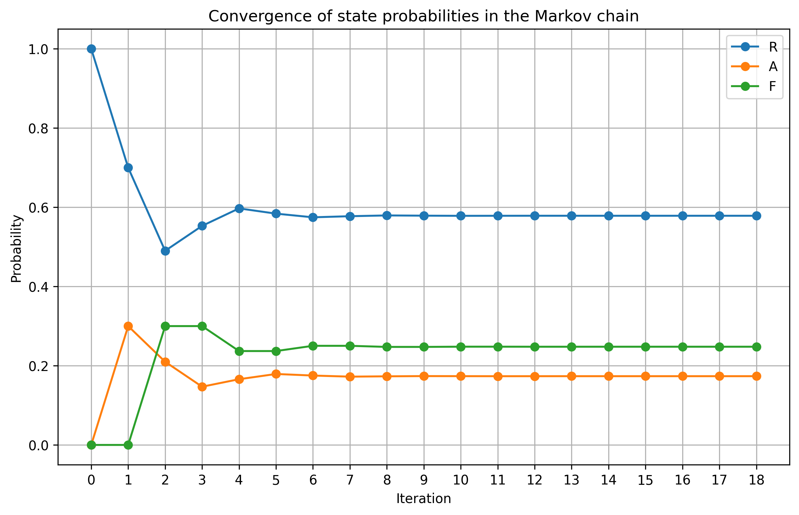

# Exercise 10 — Neuronal Dynamics as a Markov Chain

## 🇧🇷 Versão em Português

Considere um neurônio cuja dinâmica pode ser descrita, de forma discreta no tempo, por três estados:

- **Repouso (R)**: neurônio em potencial de repouso, com canais de sódio majoritariamente fechados
- **Ativo (A)**: ocorrência de potencial de ação, associado à abertura de canais de sódio
- **Refratário (F)**: estado após o disparo, no qual o neurônio não pode disparar imediatamente

Admita que a evolução desses estados pode ser modelada por uma cadeia de Markov.

As transições são dadas por:

- de (R), permanece em (R) com probabilidade (1 - p) ou vai para (A) com probabilidade p
- de (A), vai para (F) com probabilidade 1
- de (F), retorna para (R) com probabilidade q ou permanece em (F) com probabilidade (1 - q)

---

### Tarefas

1. Construa a matriz de transição considerando a ordem dos estados (R, A, F).

2.  
   a) Seja x0 = (r, a, f) um vetor de distribuição inicial  
   b) Determine os vetores x1 e x2  
   c) Escreva a forma geral: `x_n = x0 · P^n`

3. Suponha x0 = (1, 0, 0), p = 0.3 e q = 0.7. Implemente a matriz de transição e calcule x_n para n = 3.

4. Utilize Python para investigar o comportamento de longo prazo da cadeia de Markov, analisando a convergência dos estados.

5. Represente graficamente a evolução das probabilidades ao longo do tempo.

---

### Resultado Numérico

A evolução dos estados é ilustrada abaixo:

Observa-se que o sistema converge para uma distribuição estável, independentemente da condição inicial. Isso indica que a dinâmica do neurônio possui um comportamento de longo prazo bem definido, podendo ser interpretado como um regime médio de atividade neuronal.

---

## 🇺🇸 English Version

Consider a neuron whose dynamics can be described, in discrete time, by three states:

- **Resting (R)**: neuron at resting potential
- **Active (A)**: occurrence of an action potential
- **Refractory (F)**: post-spike state where the neuron cannot fire again immediately

Assume the evolution follows a Markov chain.

Transitions:

- from (R), stays in (R) with probability (1 - p) or goes to (A) with probability p
- from (A), goes to (F) with probability 1
- from (F), goes to (R) with probability q or stays in (F) with probability (1 - q)

---

### Tasks

1. Construct the transition matrix using the state order (R, A, F).

2.  
   a) Let x0 = (r, a, f) be an initial probability vector  
   b) Compute x1 and x2  
   c) Write the general form: `x_n = x0 · P^n`

3. Assume x0 = (1, 0, 0), p = 0.3, and q = 0.7. Implement the transition matrix and compute x_n for n = 3.

4. Use Python to analyze the long-term behavior of the Markov chain and observe convergence.

5. Plot the evolution of state probabilities over time.

---

### Numerical Result

The evolution of the state probabilities is shown below:

The system converges to a stable distribution, indicating a well-defined long-term behavior independent of the initial state. This can be interpreted as an average regime of neuronal activity.
